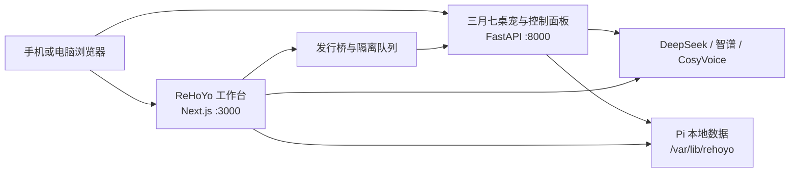

<p align="center">
  
</p>

<h1 align="center">ReHoYo Hardware Pi</h1>

ReHoYo Hardware Pi 是面向 Orange Pi 等 ARM64 Linux 设备的局域网开发测试版本。它让 Pi 负责运行 ReHoYo 工作台、三月七桌宠和统一模型控制面板，再由手机或电脑浏览器充当显示器。

主仓库：[MihYux/ReHoYo](https://github.com/MihYux/ReHoYo)

> [!IMPORTANT]
> 本仓库是为硬件适配、功能迁移和真机验证准备的**开发测试分支**，不是 ReHoYo 的正式发行版，也不能再简单理解为“主仓库去掉 Electron 后的网页版本”。
>
> 随着 ARM64 原生部署、systemd 服务、局域网访问、统一 API 控制面板、Pi 端数据存储和浏览器桌宠等能力加入，本仓库的运行架构、数据路径、鉴权方式、部分接口及产品逻辑已经与主仓库产生较大分支。两个仓库不会自动保持功能、数据格式或升级路径完全兼容，请不要将本仓库直接用于生产环境或存放唯一的重要数据。

> [!NOTE]
> 本项目是非官方同人及技术实验项目，与米哈游 / HoYoverse 无隶属、合作或背书关系。角色、名称、图像、声音及相关知识产权归原权利人所有。

## 当前状态

当前版本：`0.8.1`

当前定位：可在 Orange Pi 上真机运行和持续迭代的 ARM64 开发测试版，不是稳定版、正式版或主仓库的替代发行版。

| 能力 | 状态 | 说明 |
| --- | --- | --- |
| Orange Pi 原生安装 | 可用 | 默认下载 ARM64 Release，由 systemd 运行，不要求 Docker |
| ReHoYo 工作台 | 可用，持续迁移 | 浏览器访问，保留版本理解、区域研究、发行方案、策略导出与角色发行主流程 |
| 三月七浏览器桌宠 | 可用，持续迁移 | 支持人物显示、文字对话、长期记忆、相册、通信中心与同行设置 |
| 统一模型控制面板 | 可用 | 集中管理工作台、对话、评审、研究和 CosyVoice 配置 |
| 工作台与桌宠桥接 | 已实现，待扩大真机验收 | 交付包会校验、排队、隔离并按联系策略消费 |
| CosyVoice TTS | 条件可用 | 依赖账号、区域、模型权限、音色状态和供应商接口 |
| Docker 部署 | 备用 | 仍保留容器与本地构建方案，不是 Orange Pi 默认路径 |
| 正式发行与生产保障 | 未完成 | 尚无稳定兼容承诺、长期升级保证或完整硬件验收矩阵 |

## 与主仓库的关系

本仓库继续复用主仓库的界面风格、核心业务概念、桌宠素材和部分实现，但已经针对 Pi 的运行条件进行了独立改造。

| 维度 | ReHoYo 主仓库 | Hardware Pi |
| --- | --- | --- |
| 主要目标 | 本地桌面工作台与桌宠 | ARM64 硬件适配、局域网访问和开发验证 |
| 运行入口 | Electron 与本地 Web | FastAPI、Next.js standalone 与浏览器 |
| 进程管理 | npm / Electron | systemd，Docker 仅作备用 |
| 数据位置 | 项目 `.data`、Electron `userData` 等 | `/var/lib/rehoyo/` |
| 模型配置 | 工作台与桌宠各自配置 | Pi 端统一控制面板 |
| 访问与鉴权 | 本机桌面边界 | 可信局域网免鉴权，保留可选令牌模式 |
| 更新方式 | 主仓库源码与桌面打包流程 | ARM64 Release、健康检查与版本回滚 |

这意味着：

- 主仓库的新功能不会自动出现在本仓库，本仓库的改动也不一定能够直接合并回主仓库；
- 两边的版本号独立，不能仅根据版本号判断兼容性；
- “导入正式版 v4”只迁移明确支持的数据，不等于完整复制桌面环境；
- 切换仓库或部署方式前应备份数据，并以各自 README 和迁移文档为准；
- 当前开发优先级是先在 Orange Pi 上稳定运行，再逐步补齐功能和兼容层。

## 产品结构

### ReHoYo 全球发行工作台

工作台运行在 `3000` 端口，保留版本理解、区域判断、发行方案、策略导出和角色发行等核心页面。人工确认后的角色方案可以生成不可变交付包，再发送到桌宠侧的发行桥。

### 三月七桌宠与控制面板

桌宠和设置页面运行在 `8000` 端口。手机浏览器负责显示人物、对话、相册、通信和设置，模型请求、密钥保存、长期数据与业务判断都留在 Pi。

### 发行桥与联系策略

Pi 会校验交付包 checksum 和玩家可见字段，并根据主动联系授权、暂停、勿扰、24 小时间隔、每周上限、版本消息频率和召回授权决定发送或延后。非法交付会进入隔离目录，不影响主服务。

## 技术栈

| 层级 | 技术 |
| --- | --- |
| 硬件与系统 | ARM64、Debian / Ubuntu / Orange Pi OS、systemd |
| 桌宠与设备 API | Python、FastAPI、Uvicorn、SQLite |
| 工作台 | Next.js standalone、React、TypeScript |
| 浏览器桌宠 | React、Vite、PWA |
| 模型能力 | DeepSeek、智谱 GLM、DashScope CosyVoice |
| 原生发行 | GitHub Release、Node.js 22 ARM64、离线 Python wheels |
| 备用部署 | Docker Compose、本地 ARM64 构建 |

## 运行架构



## 快速开始

推荐环境：

- ARM64 Debian、Ubuntu 或 Orange Pi OS；
- 可使用 `sudo` 和 systemd；
- 系统 Python 3.11、3.12 或 3.13；
- Pi 和访问设备位于同一个可信局域网。

仓库是公开仓库，通过 HTTPS 克隆不需要 SSH Key：

```bash
git clone https://github.com/MihYux/hardware-pi.git
cd hardware-pi
sudo ./deploy/install-native.sh
```

安装器会补齐基础系统依赖、校验 ARM64 Release、创建低权限 `rehoyo` 用户、安装离线 Python wheels、注册两个 systemd 服务，并询问 DeepSeek、智谱和 DashScope API Key。密钥输入不会回显，可以直接回车跳过。

安装完成后访问：

```text
三月七桌宠与控制面板  http://<Orange-Pi-IP>:8000
ReHoYo 工作台         http://<Orange-Pi-IP>:3000
```

原生安装不会在 Pi 上执行 npm、Vite 或 Next.js 编译。程序、配置和数据分别存放在：

```text
/opt/rehoyo/releases/<commit>/    不可变程序版本
/etc/rehoyo/hardware-pi.env       API Key、端口与鉴权配置
/var/lib/rehoyo/                  桌宠、工作台与发行桥数据
```

## 首次设置

默认 `HARDWARE_PI_AUTH_MODE=off`。手机和 Pi 位于同一可信局域网时，打开页面即可连接，不需要填写设备令牌或管理令牌。

> [!WARNING]
> 免鉴权模式只适合受信任的家庭或开发局域网。不要把 `8000`、`3000` 端口直接暴露到公网。

模型 API Key 可以在安装阶段写入，也可以随后执行：

```bash
sudo rehoyo configure
```

网页设置中可以选择：

- 工作台生成使用的 Provider；
- 桌宠对话与发送前评审使用的 Provider；
- 区域联网研究使用的智谱配置；
- 语音使用的 CosyVoice 模型、复刻音色和播放参数。

真实 API Key 保存在 Pi，不会返回浏览器。“保存并测试”会先保存当前卡片中的 Base URL、模型 ID 和新 API Key，再实际请求模型，并显示成功延迟或具体错误。

如果手机仍显示旧页面、旧令牌或认证错误，打开“设置 → 认证与网站缓存”，点击“一键清除并刷新”。它会注销旧 Service Worker，删除本站缓存、浏览器令牌和会话 ID，但不会删除 Pi 上的 API Key、长期记忆、相册或工作台数据。

## 模型与语音配置

默认 DeepSeek 模型为 `deepseek-v4-flash`。

CosyVoice 默认配置来自 [`shared/cosyvoice-config.json`](shared/cosyvoice-config.json)：

```text
模型 ID    cosyvoice-v3.5-flash
复刻音色 ID cosyvoice-v3.5-flash-marchpet-eb86bcaeea5f40669b1798191950529a
```

在“语音”页确认你对声音样本、复刻音色和当前用途拥有必要授权后再启用语音。手机系统若阻止自动播放，先手动点击一次播放按钮以解锁音频上下文。

> [!WARNING]
> TTS 模型和复刻音色不保证在所有部署环境中可用。可用性取决于账号、区域、API 权限、音色状态以及供应商后续调整。
>
> 当前版本只实现了 DashScope CosyVoice 专用链路。如果现有模型或音色不可用，仅替换网页中的模型 ID 不一定能解决；可能还需要修改服务端请求、鉴权、流式音频解析和前端配置，加入可插拔的自定义 TTS Provider 与自定义语音模型支持。

## 常用运维命令

```bash
rehoyo status
rehoyo logs
rehoyo logs -f
sudo rehoyo restart
sudo rehoyo configure
sudo rehoyo update
sudo rehoyo rollback
```

更新会下载公开 ARM64 Release、校验 checksum、准备新版本目录并切换软链接，不覆盖配置和数据。健康检查失败时 API 会自动回到上一版本，也可以手动执行 `sudo rehoyo rollback`。

检查两个服务：

```bash
curl http://127.0.0.1:8000/api/v1/health
curl http://127.0.0.1:3000/api/project/current
```

手机无法访问时，确认手机和 Pi 位于同一局域网、路由器未启用客户端隔离，并允许 TCP `8000` 与 `3000`。网页能打开但无法进入“陪伴中”时，检查健康接口返回的 `authentication.mode` 是否为 `off`，再使用网页中的缓存清理功能。

## Docker 备用部署

Docker 方案仍保留给开发、回归和原生安装故障时使用，但不要与 systemd 原生服务同时运行，因为两者会争用 `8000` 和 `3000` 端口。

从旧 Docker 部署切换到原生安装：

```bash
cd ~/hardware-pi
docker compose down --remove-orphans
sudo ./deploy/install-native.sh
```

原生安装器首次运行时会尝试导入当前仓库的 `.env` 和 `.data`。确认网页和数据正常后，再决定是否删除 Docker 镜像或卸载 Docker Engine。

需要重新使用容器时：

```bash
sudo rehoyo stop
./deploy/install.sh
```

本地构建备用命令：

```bash
./deploy/build-local.sh
```

## 本地数据

- 统一模型设置：`/var/lib/rehoyo/control-plane.json`
- 桌宠会话与同行数据：`/var/lib/rehoyo/hardware-pi.db`
- 工作台项目、来源与发行数据：`/var/lib/rehoyo/workbench/`
- 工作台与桌宠发行桥：`/var/lib/rehoyo/bridge/`

切换部署方式、试验迁移脚本或更新大版本前，请备份 `/etc/rehoyo/hardware-pi.env` 和 `/var/lib/rehoyo/`。不要提交 `.env`、`.data`、数据库、桥接队列或任何真实 API Key。

## 开发测试边界

当前仓库优先服务于 Orange Pi 真机开发和功能验证，仍存在以下边界：

- 主仓库后续功能需要逐项评估和迁移，不承诺同步时间；
- 原生安装、发行桥、CosyVoice、断电恢复与不同 ARM64 系统组合仍需扩大真机验收；
- 可选的手机麦克风 STT 尚未实现，不影响文字对话和语音输出；
- 正式的兼容策略、数据迁移工具、稳定版本节奏和生产安全方案尚未完成；
- 开发阶段可能调整 API、数据结构和默认配置，升级前必须查看变更并保留备份。

接口与鉴权见 [`docs/API.md`](docs/API.md)，迁移边界见 [`docs/MIGRATION_PLAN.md`](docs/MIGRATION_PLAN.md)。主仓库的产品说明和桌面流程以 [MihYux/ReHoYo](https://github.com/MihYux/ReHoYo) 为准。

## 许可

代码许可与第三方素材声明以仓库内相关文件及主仓库说明为准。三月七的回复仅用于陪伴与娱乐，不构成医疗、法律、财务或其他专业意见。
